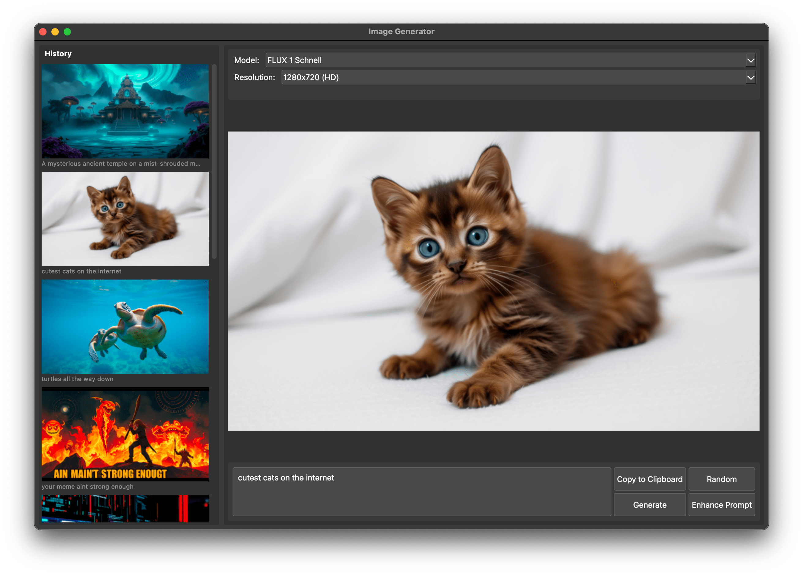

# PyImagen
PyImagen is a desktop application designed for generating AI-driven images using a variety of models via the Fal.ai API, with prompt generation facilitated by Groq's advanced capabilities.



## Features

- Generate images from text prompts utilizing multiple AI models
- Create random prompts using Groq's LLM
- Enhance prompts with additional creative details using Groq's LLM
- Maintain an image history with thumbnail previews
- Copy images directly to the clipboard
- Save images and their metadata locally for future reference

## Available Models

- FLUX 1 Schnell
- Recraft V3 
- AuraFlow
- FLUX 1.1 Pro Ultra
- FLUX 1.1 Pro
- Stable Cascade
- Fast Turbo Diffusion
- Fast LCM Diffusion
- And more...

## Requirements

- Python 3.10 or higher
- Groq API key
- Fal.ai API key

## API keys
Set `GROQ_API_KEY` and `FAL_KEY` in `.env` alternatively, enter them when the application starts.

## Installation

### From Source

1. Clone the repository
2. Install the necessary dependencies:

```bash
# Optional
python -m venv .venv && source .venv/bin/activate 
pip install -r requirements.txt
python app.py
```